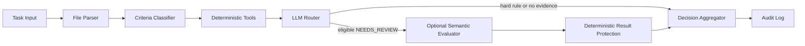

# 系统架构

Deadline Review Agent 使用“确定性工具优先、可选语义复核、最终决策保护”的单 Agent 工作流。

## 组件职责

- Task Input：Pydantic 校验任务、时间、标准、用户声明、链接、文件证据和请求模式。
- File Parser：解析 PDF、TXT、Markdown 和 JSON；原始二进制不进入 workflow。
- Criteria Classifier：决定标准使用文件格式、页数、内容、JSON、链接、提交说明或人工语义判断。
- Deterministic Tools：执行截止时间、文件元数据、完整文本关键词和冲突规则。
- LLM Router：只路由有实际可读材料的 `NEEDS_REVIEW`，并排除硬规则和外部事实。
- Optional Semantic Evaluator：使用 Responses API Structured Outputs 对有限证据片段做语义复核。
- Deterministic Result Protection：恢复并锁定原规则 `PASS/FAIL`，防止模型覆盖事实。
- Decision Aggregator：汇总单项状态、时间状态、建议与综合置信度。
- Audit Log：保存脱敏结构化过程，不保存 Key、二进制、完整文档或异常堆栈。

## 失败边界

LLM 不可用或失败时，文件解析、确定性规则、聚合和日志仍可独立运行。自动模式没有配置时使用 `rule_based`；显式启用但配置缺失或 API 调用失败时使用 `fallback_rule_based`。
